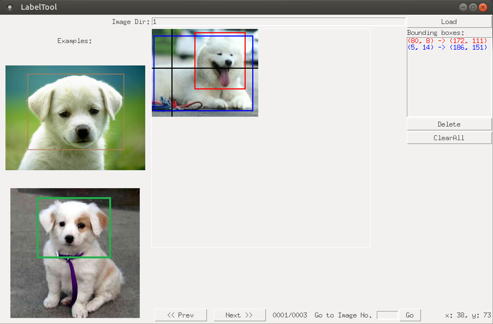

BBox-Label-Tool
===============

A simple tool for labeling object bounding boxes in images, implemented with Python Tkinter.

**Updates:**
- 2017.5.21 Check out the ```multi-class``` branch for a multi-class version implemented by @jxgu1016
- 2022.7.05 box 좌측 상단에 label을 text 로 띄워주도록 추가했습니다. 
z 키를 누르면 마지막 box 친것을 지워주고, c 키를 누르면 이전 사진의 label 을 불러오는
기능을 추가했습니다. 또한 11~20의 class는 a1~a0을 누르면 전환되며, 20번대는 s, 30번대는 d, 
40번대는 f 를 통해 전환 가능합니다.


**Screenshot:**


Data Organization
-----------------
LabelTool  
|  
|--bbox.py   *# source code for the tool*  
|  
|--Images/   *# direcotry containing the images to be labeled*  
|  
|--Labels/   *# direcotry for the labeling results*  
|  
|--Examples/  *# direcotry for the example bboxes*  

Environment
----------
- python 2.7
- python PIL (Pillow)

- python 3.7
    - sudo apt install python3.7-tk
Run
-------
$ python bbox.py

Usage
-----
0. The current tool requires that **the images to be labeled reside in /Images/001, /Images/002, etc. You will need to modify the code if you want to label images elsewhere**.
1. Input a folder number (e.g, 1, 2, 5...), and click `Load`. The images in the folder, along with a few example results will be loaded.
2. To create a new bounding box, left-click to select the first vertex. Moving the mouse to draw a rectangle, and left-click again to select the second vertex.
  - To cancel the bounding box while drawing, just press `<Esc>`.
  - To delete a existing bounding box, select it from the listbox, and click `Delete`.
  - To delete all existing bounding boxes in the image, simply click `ClearAll`.
3. After finishing one image, click `Next` to advance. Likewise, click `Prev` to reverse. Or, input an image id and click `Go` to navigate to the speficied image.
  - Be sure to click `Next` after finishing a image, or the result won't be saved. 
